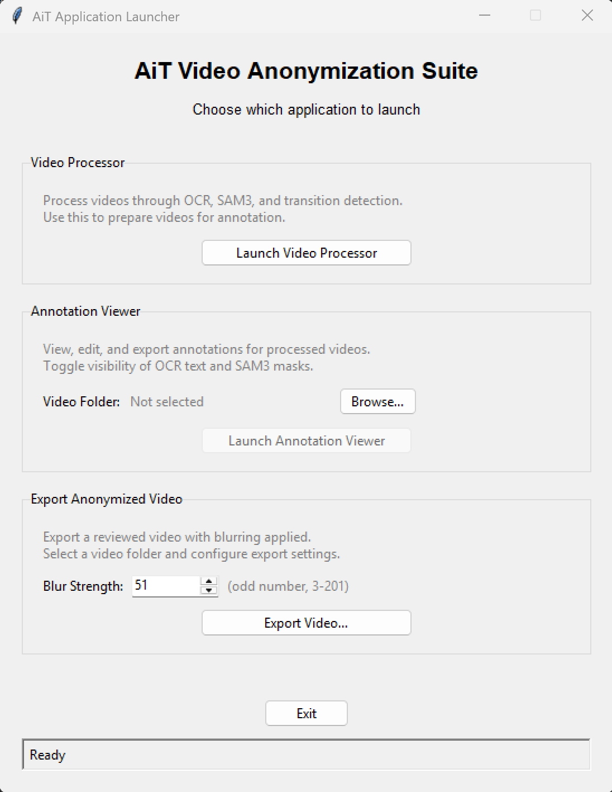
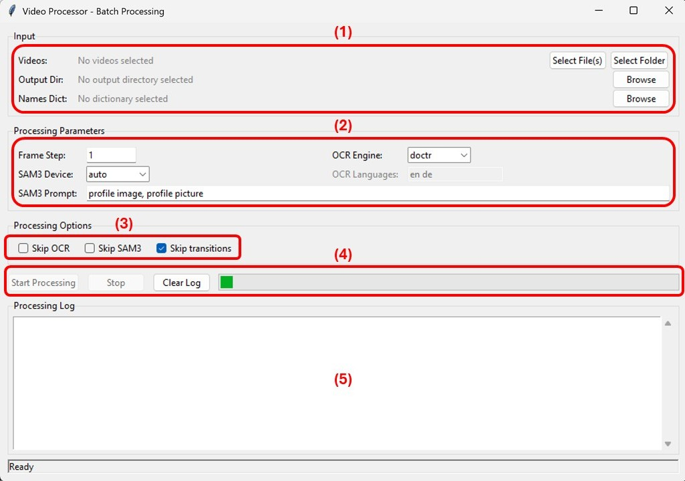
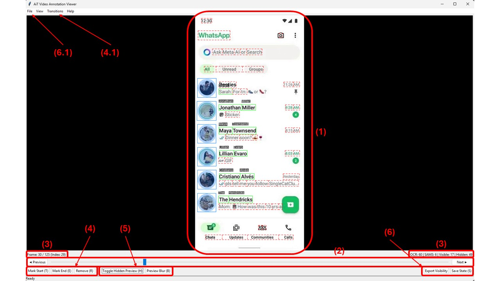

# AiT — Anonymization in Time

Video anonymization tool for chat recordings. Detects names (OCR) and profile pictures (segmentation) in video frames, then lets you review and export anonymized videos with blurring applied.

## Features

- **Processing pipeline**: Frame extraction, OCR text detection, SAM3 segmentation, scene transition detection
- **Annotation viewer**: Navigate frames, toggle annotation visibility, preview hidden annotations on hover
- **Video export**: Apply Gaussian blur to visible annotations for anonymization
- **Cross-platform**: Works on Windows, Mac, and Linux

## Project Structure

```
AiT_app/
├── ait/                     # Main Python package
│   ├── ocr/                 # OCR text detection pipeline (EasyOCR)
│   ├── segmentation/        # Profile picture segmentation pipeline (SAM3)
│   ├── viewer/              # Tkinter annotation viewer app
│   ├── utils.py             # Shared utilities (frame extraction, device management)
│   ├── process_videos.py    # Pipeline orchestrator
│   ├── export_video.py      # Anonymized video export
│   ├── launcher.py          # GUI launcher
│   └── ...
├── tools/                   # Development/debug tools
│   ├── inspect_sam3_pipeline.py
│   └── inspect_ocr_pipeline.py
├── pyproject.toml
├── requirements.txt
└── sam3.pt                  # Model weights (download separately)
```

## Installation

### 1. Install the package

```bash
pip install -e .
```

Or with requirements.txt:
```bash
pip install -r requirements.txt
pip install -e .
```

### 2. PyTorch (for processing)

If you need GPU acceleration, install PyTorch with CUDA before the package:
```bash
# CUDA 12.6
pip install torch==2.7.0 torchvision torchaudio --index-url https://download.pytorch.org/whl/cu126

# CPU/MPS (default)
pip install torch==2.7.0 torchvision==0.22.0 torchaudio==2.7.0
```

### 3. SAM3 model weights

> ⚠️ **SAM 3 Model Weights Required**
> Unlike other Ultralytics models, SAM 3 weights are not automatically downloaded. You must:
> 1. Request access on the [SAM 3 model page on Hugging Face](https://huggingface.co/facebook/sam3.1)
> 2. Once approved, download the `sam3.1_multiplex.pt` file
> 3. Rename it to `sam3.pt` and place it in the project root

The segmentation pipeline looks for `sam3.pt` in the working directory.

### 4. ffmpeg

Required for frame extraction:
- **Windows**: Download from https://ffmpeg.org and add to PATH
- **macOS**: `brew install ffmpeg`
- **Linux**: `sudo apt install ffmpeg`

## Usage

After installation, these CLI commands are available:

```bash
ait              # Launch the GUI (choose between processor and viewer)
ait-process      # Run the video processing pipeline
ait-viewer       # Open the annotation viewer
ait-export       # Export anonymized video
```

Or run directly with Python:
```bash
python -m ait.launcher
python -m ait.process_videos --help
python -m ait.annotation_viewer
python -m ait.export_video --help
```

---

## Launcher

The `ait` command opens the AiT launcher — the central hub for the three tools.



- **Video Processor** — runs the detection pipeline on your video files. Click **Launch Video Processor** to open it.
- **Annotation Viewer** — lets you review and refine detections before exporting. Select a processed video folder first, then click **Launch Annotation Viewer**.
- **Export Anonymized Video** — exports the final video with blur applied. Set the **Blur Strength** (Gaussian kernel size, odd number between 3 and 201 — higher means stronger blur, default 51), select a processed folder, and click **Export Video**.

---

## Video Processor

The Video Processor runs the full detection pipeline on your videos: frame extraction, OCR name detection, SAM3 profile picture segmentation, and scene transition detection.



### Input (1)

| Field | Description |
|-------|-------------|
| **Videos** | Select individual video files or a folder containing videos. Supported formats: `.mp4`, `.avi`, `.mov`, `.mkv`, `.webm` |
| **Output Dir** | Where processed results are saved. Each video gets its own subfolder with extracted frames, `ocr.pkl`, and `sam3.pkl` |
| **Names Dict** | A JSON file mapping real names to pseudonyms (alteregos). Format: `{"Real Name": "Fake Name"}`. Names with an empty string `""` are detected and the text box blurred, but no alterego name is drawn on top |

### Processing Parameters (2)

| Parameter | Description |
|-----------|-------------|
| **Frame Step** | Extract every Nth frame (default: `1` = all frames). Use higher values to speed up processing on long videos. Keep in mind that more frames skipped means less accuracy |
| **OCR Engine** | Choose between **docTR** and **EasyOCR**. **docTR** works best for phone/tablet UIs and documents with clean text rendering. **EasyOCR** is better for real-world videos with varied fonts and backgrounds, but requires specifying the language(s) |
| **OCR Languages** | Only used with EasyOCR. Space-separated language codes, e.g. `en de` for English and German |
| **SAM3 Device** | `auto` picks the best available accelerator (CUDA > MPS > CPU). You can force a specific device if needed |
| **SAM3 Prompt** | The text prompt that guides SAM3 segmentation. The default `"profile image, profile picture"` works well for chat recordings |

### Processing Options (3)

| Option | Description |
|--------|-------------|
| **Skip OCR** | Skip the OCR detection stage (useful for re-running only segmentation) |
| **Skip SAM3** | Skip the segmentation stage |
| **Skip transitions** | Skip scene transition detection (enabled by default since it's usually only needed for specific use cases) |

Frame extraction is always automatic: if frames already exist in the output folder with the correct count, extraction is skipped.

### Controls (4)

- **Start Processing** — begins the pipeline (enabled once Videos, Output Dir, and Names Dict are all set)
- **Stop** — stops processing **after the current step completes**
- **Clear Log** — clears the processing log
- The **progress bar** animates while processing is active

### Processing Log (5)

Real-time output from the pipeline, showing progress for each stage.

---

## Annotation Viewer

The Annotation Viewer lets you review and refine the automated detections before exporting the anonymized video. You can toggle individual annotations on/off to control exactly what gets blurred.



### Canvas (1)

The main display area showing the current video frame with annotation overlays:
- **Green boxes** — visible OCR detections (will be blurred on export). The alterego name is displayed on top of the original text
- **Blue masks** — visible SAM3 segmentation masks (profile pictures)
- **Click** on any visible annotation to **hide** it — it will no longer be blurred on export (and viceversa)
- **Right-click** on a word to toggle the entire parent name (e.g. clicking on "Mark" toggles both "Mark" and "Jhonson")
- Enable **Hidden Preview** (H) to see hidden annotations as semi-transparent outlines — click them to make them visible (and blurred) again

### Frame Navigation (2)

- **Slider** — drag to jump to any frame
- **Previous / Next buttons** — step one frame at a time
- **Mouse wheel** — scroll to navigate frames (one frame per tick)
- **Arrow keys**: Left/Right = 1 frame, Up/Down = 10 frames, Home/End = first/last frame

### Frame Info (3)

Shows the current frame position, frame index, and annotation statistics (OCR count, SAM3 count, visible/hidden counts). If the current frame is inside a transition range, a `[TRANSITION]` indicator appears.

### Transition Controls (4)

Transitions mark frame ranges where the video content changes (e.g. a window switch, a new chat being opened). During export, transition frames are fully blurred to prevent leaking content from the old/new view.

| Button | Shortcut | Description |
|--------|----------|-------------|
| **Mark Start** | `T` | Mark the current frame as the start of a transition |
| **Mark End** | `E` | Mark the current frame as the end — creates the transition range |
| **Remove** | `R` | Remove the transition range at the current frame |

Use the **Transitions** menu to list (4.1) all transitions or save them.

### View Controls (5)

| Button | Shortcut | Description |
|--------|----------|-------------|
| **Toggle Hidden Preview** | `H` | Show hidden annotations as semi-transparent outlines, so you can find and re-enable them |
| **Preview Blur** | `B` | Preview what the exported video will look like with blur applied to all visible annotations |

### Save & Export (6)

| Button | Shortcut | Description |
|--------|----------|-------------|
| **Save State** | `S` / `Ctrl+S` | Save visibility toggles and transition ranges so you can resume later |
| **Export Visibility** | — | Export the visibility state as a standalone pickle file |
| **Export Anonymized Video** | — | Available from the **File** menu (6.1). Exports the video with Gaussian blur applied to all visible annotations and full blur on transition frames |