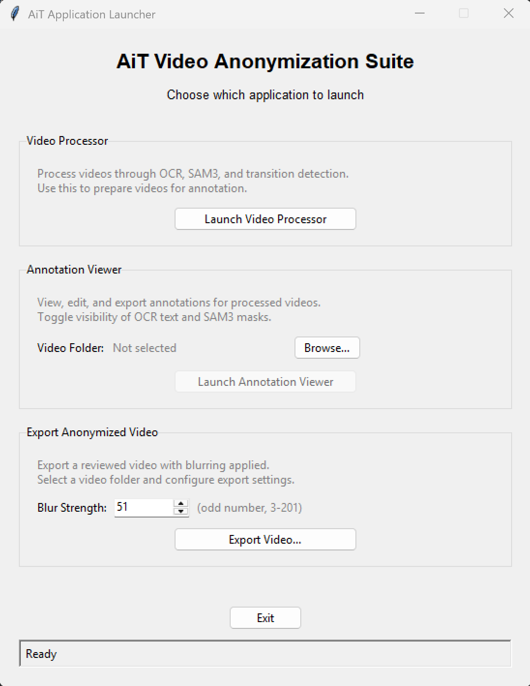
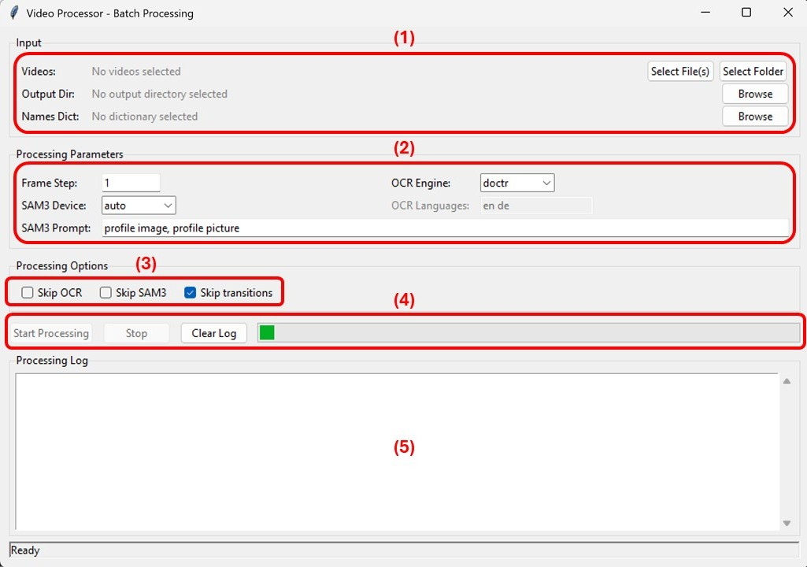
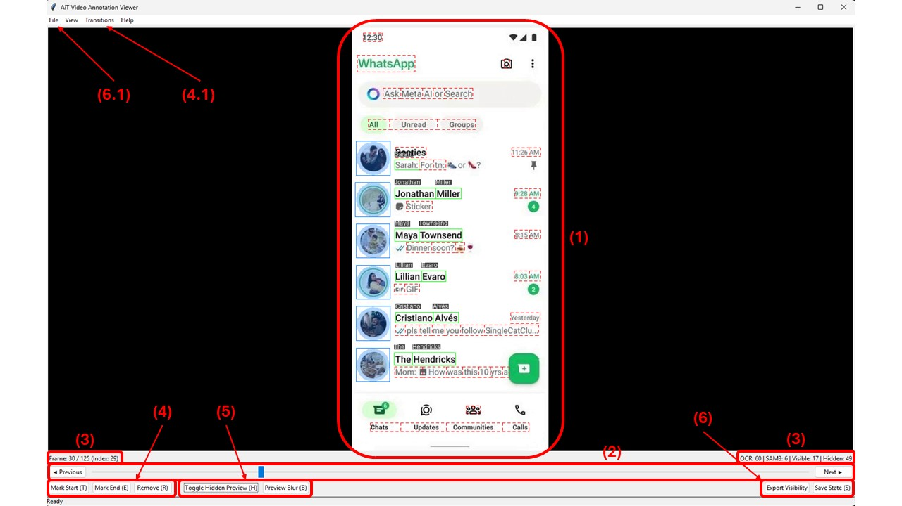

# AiT — Anonymization in Time

Video anonymization tool for chat recordings. Detects names (OCR) and profile pictures (segmentation) in video frames, then lets you review and export anonymized videos with blurring applied.

## Features

- **Processing pipeline**: Frame extraction, OCR text detection, SAM3 segmentation, scene transition detection. Folder input is searched **recursively** and the output **mirrors the source folder tree** (same-named videos in different subfolders stay separate)
- **Annotation viewer**: Navigate frames, toggle annotation visibility, preview hidden annotations on hover
- **Video export**: Apply Gaussian blur to visible annotations for anonymization, with a **sequential export queue** for batching multiple videos
- **Cross-platform**: Works on Windows, Mac, and Linux

## Project Structure

```
AiT_app/
├── ait/                     # Main Python package
│   ├── ocr/                 # OCR text detection pipeline (EasyOCR)
│   ├── segmentation/        # Profile picture segmentation pipeline (SAM3)
│   ├── viewer/              # Tkinter annotation viewer app
│   ├── utils.py             # Shared utilities (frame extraction, device management)
│   ├── process_videos.py    # Pipeline orchestrator
│   ├── export_video.py      # Anonymized video export
│   ├── launcher.py          # GUI launcher
│   └── ...
├── tools/                   # Development/debug tools
│   ├── inspect_sam3_pipeline.py
│   └── inspect_ocr_pipeline.py
├── pyproject.toml
└── requirements.txt

# SAM3 model weights (download separately, point AiT at them via the GUI or --sam3_model)
```

## Installation

### 1. PyTorch

For GPU acceleration, install the CUDA build **before** the package:
```bash
# CUDA 12.6 (replace cu126 with your version, e.g. cu118, cu121, cu124)
pip install torch torchvision torchaudio --index-url https://download.pytorch.org/whl/cu126
```

Check your CUDA version with `nvidia-smi`. Skip this step if CPU-only is fine.

### 2. Install the package

```bash
pip install anonymization-in-time
```

**For development** (editable install from source):
```bash
pip install -e .
```

With [uv](https://docs.astral.sh/uv/):
```bash
uv sync
```

> **Note (uv users):** SAM3's text prompts require Ultralytics' [CLIP fork](https://github.com/ultralytics/CLIP), which Ultralytics normally installs at runtime via pip — this fails in uv-managed environments, which don't include pip. `uv sync` installs it automatically (it's in the `dev` dependency group). If you install the package from PyPI with uv instead, add it explicitly, e.g. `uv tool install anonymization-in-time --with git+https://github.com/ultralytics/CLIP.git`.

### 3. SAM3 model weights


> ⚠️ **SAM 3 Model Weights Required**
> Unlike other Ultralytics models, SAM 3 weights are not automatically downloaded. You must:
> 1. Request access on the [SAM 3 model page on Hugging Face](https://huggingface.co/facebook/sam3.1)
> 2. Once approved, download the `sam3.1_multiplex.pt` file
> 3. Rename it to `sam3.pt` and put it anywhere on disk

Then point AiT at it using **one** of:

- **GUI** — open the Video Processor and use the **SAM3 Model** *Browse...* button. The path is saved to `~/.ait/config.json` so you only do this once.
- **CLI** — pass `--sam3_model /path/to/sam3.pt` to `ait-process`.
- **Project root** — keep `sam3.pt` in the directory you launch `ait` from (legacy dev workflow).

Lookup order at runtime: explicit argument → `~/.ait/config.json` → `./sam3.pt`. If none resolve, AiT prints a clear error showing exactly where it looked.

### 4. ffmpeg

Required for frame extraction:
- **Windows**: Download from https://ffmpeg.org and add to PATH
- **macOS**: `brew install ffmpeg`
- **Linux**: `sudo apt install ffmpeg`

## Usage

After installation, these CLI commands are available:

```bash
ait              # Launch the GUI (choose between processor and viewer)
ait-process      # Run the video processing pipeline
ait-viewer       # Open the annotation viewer
ait-export       # Export anonymized video
```

Or run directly with Python:
```bash
python -m ait.launcher
python -m ait.process_videos --help
python -m ait.annotation_viewer
python -m ait.export_video --help
```

---

## Launcher

The `ait` command opens the AiT launcher — the central hub for the three tools.



- **Video Processor** — runs the detection pipeline on your video files. Click **Launch Video Processor** to open it.
- **Annotation Viewer** — lets you review and refine detections before exporting. Select a processed video folder first, then click **Launch Annotation Viewer**.
- **Export Queue** — exports one or more reviewed videos with blur applied, running them **sequentially** (one at a time). Set the **Blur Strength** (Gaussian kernel size, odd number between 3 and 201 — higher means stronger blur, default 51), then **Add to Queue…** — point it at a single processed folder or a parent holding many (e.g. a mirrored output tree) to enqueue them all at once. See [Export Queue](#export-queue) below for the full workflow.

---

## Video Processor

The Video Processor runs the full detection pipeline on your videos: frame extraction, OCR name detection, SAM3 profile picture segmentation, and scene transition detection.



### Input (1)

| Field | Description |
|-------|-------------|
| **Videos** | Select individual video files or a folder containing videos. **Select Folder** searches the folder **recursively** through nested subfolders at any depth, so you can point it at a whole project tree. Supported formats (case-insensitive): `.mp4`, `.avi`, `.mov`, `.mkv`, `.flv`, `.wmv`, `.webm`. Videos are processed in a deterministic order based on their path relative to the selected folder |
| **Output Dir** | Where processed results are saved. The output **mirrors the source folder tree**: a video at `a/b/clip.mp4` (relative to the selected folder) produces its pipeline files under `a/b/clip/` inside the output dir, each folder holding extracted frames, `ocr.pkl`, and `sam3.pkl`. Because the folder structure is reproduced, two same‑named videos in different subfolders never share or overwrite one output folder. Individually picked files (not a folder) keep a flat per‑stem folder |
| **Names Dict** | A JSON file mapping real names to pseudonyms (alteregos). Format: `{"Real Name": "Fake Name"}`. Names with an empty string `""` are detected and the text box blurred, but no alterego name is drawn on top |

### Processing Parameters (2)

| Parameter | Description |
|-----------|-------------|
| **Frame Step** | Extract every Nth frame (default: `1` = all frames). Use higher values to speed up processing on long videos. Keep in mind that more frames skipped means less accuracy |
| **OCR Engine** | Choose between **docTR** and **EasyOCR**. **docTR** works best for phone/tablet UIs and documents with clean text rendering. **EasyOCR** is better for real-world videos with varied fonts and backgrounds, but requires specifying the language(s) |
| **OCR Languages** | Only used with EasyOCR. Space-separated language codes, e.g. `en de` for English and German |
| **SAM3 Device** | `auto` picks the best available accelerator (CUDA > MPS > CPU). You can force a specific device if needed |
| **SAM3 Prompt** | The text prompt that guides SAM3 segmentation. The default `"profile image, profile picture"` works well for chat recordings |
| **SAM3 Model** | Path to the SAM3 checkpoint (`sam3.pt`). Use **Browse...** to pick it once — the path is saved to `~/.ait/config.json` and reused on every launch. Leave blank to fall back to `./sam3.pt` |

### Processing Options (3)

| Option | Description |
|--------|-------------|
| **Skip OCR** | Skip the OCR detection stage (useful for re-running only segmentation) |
| **Skip SAM3** | Skip the segmentation stage |
| **Skip transitions** | Skip scene transition detection (enabled by default since it's usually only needed for specific use cases) |

Frame extraction is always automatic: if frames already exist in the output folder with the correct count, extraction is skipped.

### Controls (4)

- **Start Processing** — begins the pipeline (enabled once Videos, Output Dir, and Names Dict are all set)
- **Stop** — stops processing **after the current step completes**
- **Clear Log** — clears the processing log
- The **progress bar** animates while processing is active

### Processing Log (5)

Real-time output from the pipeline, showing progress for each stage.

---

## Annotation Viewer

The Annotation Viewer lets you review and refine the automated detections before exporting the anonymized video. You can toggle individual annotations on/off to control exactly what gets blurred.



### Canvas (1)

The main display area showing the current video frame with annotation overlays:
- **Green boxes** — visible OCR detections (will be blurred on export). The alterego name is displayed on top of the original text
- **Blue masks** — visible SAM3 segmentation masks (profile pictures)
- **Click** on any visible annotation to **hide** it — it will no longer be blurred on export (and viceversa)
- **Right-click** on a word to toggle the entire parent name (e.g. clicking on "Mark" toggles both "Mark" and "Jhonson")
- Enable **Hidden Preview** (H) to see hidden annotations as semi-transparent outlines — click them to make them visible (and blurred) again

### Frame Navigation (2)

- **Slider** — drag to jump to any frame
- **Previous / Next buttons** — step one frame at a time
- **Mouse wheel** — scroll to navigate frames (one frame per tick)
- **Arrow keys**: Left/Right = 1 frame, Up/Down = 10 frames, Home/End = first/last frame

### Frame Info (3)

Shows the current frame position, frame index, and annotation statistics (OCR count, SAM3 count, visible/hidden counts). If the current frame is inside a transition range, a `[TRANSITION]` indicator appears.

### Transition Controls (4)

Transitions mark frame ranges where the video content changes (e.g. a window switch, a new chat being opened). During export, transition frames are fully blurred to prevent leaking content from the old/new view.

| Button | Shortcut | Description |
|--------|----------|-------------|
| **Mark Start** | `T` | Mark the current frame as the start of a transition |
| **Mark End** | `E` | Mark the current frame as the end — creates the transition range |
| **Remove** | `R` | Remove the transition range at the current frame |

Use the **Transitions** menu to list (4.1) all transitions or save them.

### View Controls (5)

| Button | Shortcut | Description |
|--------|----------|-------------|
| **Toggle Hidden Preview** | `H` | Show hidden annotations as semi-transparent outlines, so you can find and re-enable them |
| **Preview Blur** | `B` | Preview what the exported video will look like with blur applied to all visible annotations |

### Save & Export (6)

| Button | Shortcut | Description |
|--------|----------|-------------|
| **Save State** | `S` / `Ctrl+S` | Save visibility toggles and transition ranges so you can resume later |
| **Export Visibility** | — | Export the visibility state as a standalone pickle file |
| **Export Anonymized Video** | — | Available from the **File** menu (6.1). Exports the video with Gaussian blur applied to all visible annotations and full blur on transition frames |

---

## Export Queue

The launcher's **Export Queue** lets you export several processed videos in one session. Jobs run **sequentially — at most one export process runs at a time** — and the UI stays responsive throughout (the queue is polled on the Tkinter event loop rather than blocking).

### Adding jobs

1. Set the **Blur Strength** (odd number, 3–201). The value is **captured per job at the moment you add it**, so you can queue different strengths for different videos.
2. Click **Add to Queue…** and pick a folder. This can be a **single processed video folder** or a **parent holding several** (e.g. a whole mirrored output tree) — every pipeline folder found underneath is offered for enqueue.
3. A folder counts as a pipeline folder if it contains a `frames/` subdirectory **and** at least one of `state.pkl`, `ocr.pkl`, `sam3.pkl`, or `sam3_circular.pkl`.

**Output paths default automatically** to `<folder>_anonymized.mp4` right next to each pipeline folder, so you don't have to navigate a save dialog for every video — you can override the path when adding a single folder.

**SAM3 masks**: when a folder has both original (`sam3.pkl`) and circular (`sam3_circular.pkl`) masks, you choose which to export. The choice defaults to whatever you selected for that video in the Annotation Viewer (recorded in `mask_choice.txt`). If the folder has reviewed annotations (`state.pkl`), those masks are used and the toggle is disabled.

**Delete after export**: the add dialog has an optional **Delete pipeline folder after successful export** checkbox. When enabled, the processed folder (frames + pickles) is removed once its export finishes successfully — handy for reclaiming disk after producing the final video. It is **never** deleted on failure or cancellation.

Each queued job shows its **source folder**, **output file**, **blur**, **masks** (`reviewed`/`original`/`circular`), **del** (whether it will be deleted), and **status**.

**Duplicates are rejected** with a message: you cannot queue the same source folder twice, and you cannot point two jobs at the same output file. This keeps every export destination explicit and non-conflicting. (Overwriting a pre-existing file on disk still goes through the normal save-dialog confirmation.)

### Controls

| Control | Behavior |
|---------|----------|
| **Add to Queue…** | Validate and enqueue a new job (see above) |
| **Start Queue** | Begin exporting pending jobs in order. Disabled while an export is already running or when there is nothing pending |
| **Cancel Active** | Stop the export that is currently running (marked **cancelled**). Remaining **pending jobs continue** automatically |
| **Remove Selected** | Remove a selected **pending** job. Running or finished jobs cannot be removed |
| **Clear Pending** | Drop all pending jobs, leaving any running or finished jobs untouched |

### Status and failures

Each job ends in one of: **succeeded**, **failed**, or **cancelled**; a live aggregate summary is shown beneath the table. Failures are **isolated to the individual job** — if an export fails to launch or its process exits with a non-zero code, that job is marked **failed** and the queue automatically advances to the next pending job.

### Cancellation and closing

- **Cancel Active** stops only the running export and then continues with the remaining pending jobs.
- Closing the launcher while exports are running or pending prompts for confirmation. On confirmation, the active export process is terminated and all pending jobs are cancelled **before** the window closes, so no export process or hidden queue is left running in the background.
- Separately launched **Video Processor** and **Annotation Viewer** windows are independent processes; closing the launcher warns about them but does not force them to close.